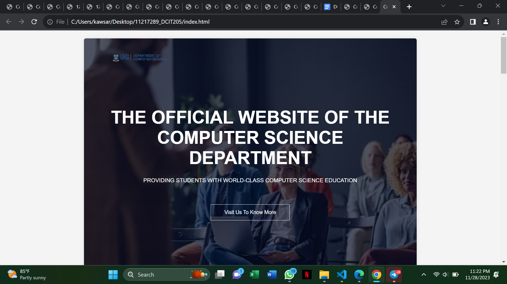

# DCIT_205_IA
## Introduction
The aim of this project in cloning the school website is to enable use our website designing knowledge practically.The purpose of this website is to allow students to easily get to know more about the Computer science course.

## Instructions
To clone the project, you go to the repository it is being stored in.
- Fork the repository into your account.
- Copy the repository's https://github.com/mahfuuzz/11217289_DCIT205.git
- Open your terminal and navigate to where you want to store the repository.
- Type git clone and paste the https://github.com/mahfuuzz/11217289_DCIT205.git of the repository you copied.
- Press and enter to clone the project locally.
- Open your IDE to begin work on the project.

## Mahfuuz Mustapha 11217289

## Screenshots

 

    
    
    
    
   

This assignment taught me fully how to clone and create a website